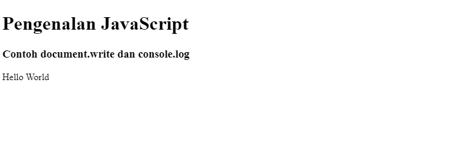
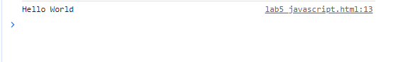
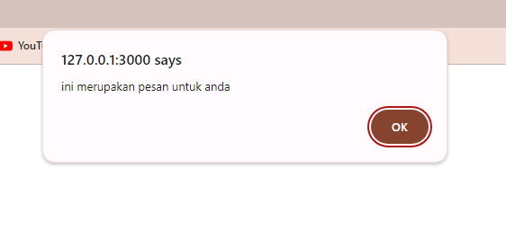

# Lab5Web

# 1. Kita membuat h1, h3 dan document write yang hasil nya ada di layar dan ada di console.log  
Ini adalah kode nya  
  
Ini adalah hasil nya document write  
  
Ini adalah hasil nya console.log  
   

# 2. Membuat Window Alert  
Ini adalah kode nya  
 
Ini hasil tampilan nya  
  
# 3. Pemakaian method dalam objek  
Ini adalah kode nya  
 
Ini adalah tampilan hasil nya  
  
# 4. Penggunaan Prompt Dalam Java Script  
Ini adalah kode nya  
 
Ini adalah tampilan nya  
 
  
# 5. Pembuatan fungsi dan cara pemanggilannya  
 
Ini adalah hasil nya  
  
# 6. Operasi dasar aritmatika  
Ini adalah code nya  
  
Inia adalah hasil nya  
 
# 7. Membuat program  IF ELSE  
  
Ini adalah hasil nya  
 
 
 
 
   
# 8. Penggunaan operator switch untuk seleksi kondisi  
  
Ini adalah hasil nya  
    
# 9. Pembuatan Form  
 
Ini adalah hasil nya  
   
# 10. Form Button  
 
Ini adalah hasil nya  
  
# 11. CheckBox dengan perhitungan otomatis  
 
Ini adalah hasil nya  
   
# 12. validasi pada isian form  
 
Ini adalah hasil nya  
  

