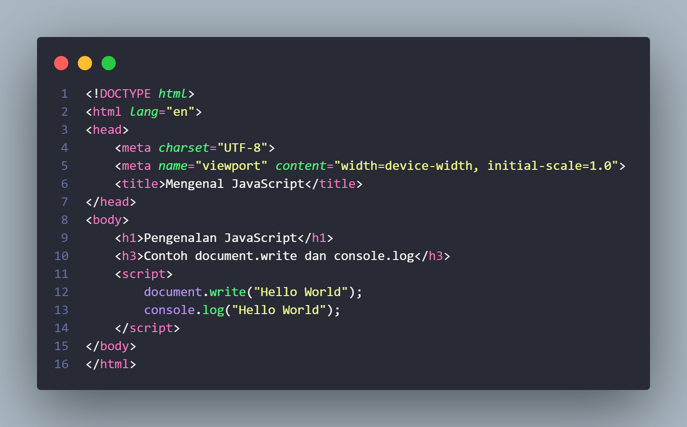

# Lab5Web

# 1. Kita membuat h1, h3 dan document write yang hasil nya ada di layar dan ada di console.log  
Ini adalah kode nya  
  
Ini adalah hasil nya document write  
  
Ini adalah hasil nya console.log  
   

